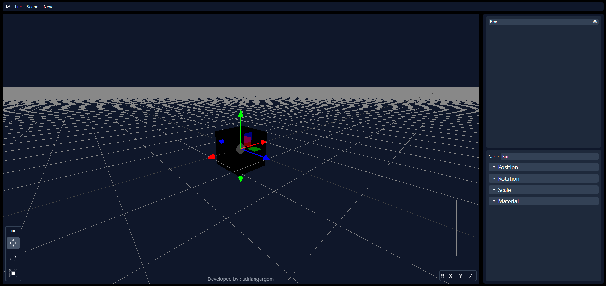

#  Vortex Editor

## Table of Content

1. [Project Description](#project-description)
2. [Technologies](#technologies)
3. [Features](#features)
    - [Model Import and Export](#model-import-and-export)
    - [Scene and Fog Settings](#scene-and-fog-settings)
    - [Model and Light Creation](#model-and-light-creation)
    - [Hierarchy](#hierarchy)
    - [Inspector](#inspector)
    - [Tools](#tool-panels)
4. [Keyboard Shortcuts](#keyboard-shortcuts)
    - [Movement Controls](#movement-controls)
    - [General Shortcuts](#general-shortcuts)

## Project Description

This project was developed to enhance my skills with Angular and best practices from the development to the deployment of the application. It features a 3D editor that enables users to interact with objects in a 3D environment with the provided tools, also features a user-friendly responsive UI that can be customized to meet the user preferences.

The project can be tested in the following URL: https://vortex-editor-37e8d.web.app/editor

## Technologies

The technologies employed in this project encompass `Angular` with `Typescript` for the frontend development, `RXJS` for managing asynchronous data flows with observables, `Three.js` for WebGL rendering in the browser, `Tailwind CSS` for streamlined application styling, `Git` for version control, and `Firebase` for hosting the final application.

| Field       | Technology |
|:------------|:-----------|
| Languages   |  |
| Frontend    |     |
| DevOps      |                                         |

## Features

Currently, the project includes the following features, with plans to implement additional functionality over the time:

### Model Import and Export

- `Import`: User can import 3D models in `.glb` format into the scene.

- `Export`: User can export the currently selected model or the entire scene in `.gbl` format.

### Scene and Fog Settings

- `Scene settings`: User can manage various scene settings, such as the name or background color.

- `Fog settings`: Users can adjust fog attributes, including the draw distance, color and toggle it on or off.

### Model and Light Creation

- `3d Models`: The project allows for the creation of various 3D models in the scene such as cubes, spheres, capsules and more.

- `Light sources`: Users can create different types of light sources to achieve various lighting effects.

### Hierarchy

- `Hierarchy panel`: In the hierarchy panel, users can view all objects in the scene in a tree format and expand or collapse nested objects.

- `Object Visibility`: Users can toggle the visibility of objects and their nested children by using the option next to the object's name in the hierarchy.

- `Object drag and drop`: Users can drag and drop objects to reposition them within the hierarchy, nest them inside other objects, or move them to the base scene.

### Inspector

- `Inspector panel`: In the inspector panel, users can edit attributes of the currently selected object, such as position, rotation and scale. All changes are updated in real time in the scene, without the need to save or reload.

### Tool

- `Tools`: Within the scene frame, users can find a tools panel that displays the three currently available tools: translate, rotate, and scale. The active tool is highlighted. This panel can be dragged and dropped within the scene. Users can switch between tools by clicking on them or using keyboard shortcuts.

- `Camera axis`: Additionally, there is a camera axis panel displaying the X, Y, and Z axes. Clicking on an axis repositions the camera to align with that axis. This panel can also be dragged and dropped within the scene frame.

## Keyboard Shortcuts

### Movement Controls

The following table lists the controls for moving the camera around the scene:

| Key                                   | Utility                                   |
|:--------------------------------------|:------------------------------------------|
| Scroll Wheel                          | Zooms the camera                          |
| Scroll Click + Mouse Movement         | Rotates the camera                        |
| Shift + Scroll click + mouse movement | Moves the camera around the scene         |

### General Shortcuts

The following table lists all implemented shortcuts in the application and their descriptions:

| Shortcut                  | Utility                                   |
|:--------------------------|:------------------------------------------|
| Escape                    | Deselect the currently selected shape     |
| Delete                    | Delete the currently selected shape       |
| Ctrl + C                  | Copies the currently selected object      |
| Ctrl + V                  | Paste the previously copied object        |
| Ctrl + X                  | Cut the currently selected object         |
| F                         | Focus the currently selected object       |
| Alt + T                   | Selects the translate tool                |
| Alt + R                   | Selects the rotation tool                 |
| Alt + S                   | Selects the scale tool                    |
| Click on a scene object   | Selects the clicked object                |
